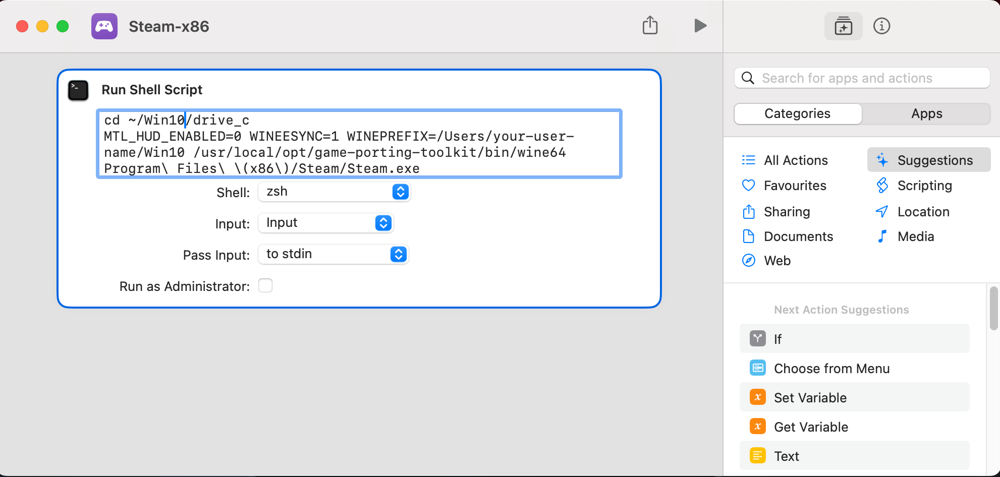

# Howto install the Windows version of Steam on macOS Sonoma

We will install the x86 version Homebrew in order to be able to use Apple's modified version of `Wine` and to install the Windows version Steam.

We will make sure that our existing environment (and the Apple silicon version of Homebrew we need for 'serious' work) remains undisturbed.


This guide is only tested for Apple Silicon machines.

## Latest tested versions

- 2023-10-06: the combination of macOS Sonoma 14.0 (release version) and apple `game-porting-toolkit` 1.1 (release of 2023-11-15), Xcode 15.

## Preparations:

- Go to [Apple Games](https://developer.apple.com/games/) in order to download the [game porting toolkit](https://developer.apple.com/download/all/?q=game%20porting%20toolkit)
- Command Line Tools for Xcode 15, or Xcode 15 itself is required to be able to install `game-porting-toolkit`

This contains a Readme that outlines the process, but here we will customize it, in order to run Steam.

- [Download Steam](https://store.steampowered.com/about/download). Make sure to download the [Windows setup](https://cdn.akamai.steamstatic.com/client/installer/SteamSetup.exe), and not the (default) Mac version. You should now have a file `SteamSetup.exe`.

## Step-by-step installation

**Note:** See `Update notes` below, if you did already install an older version!

- The minimum macOS version is macOS Sonoma 14.0, Xcode 15 (or Command Line Tools), Game Porting Toolkit v1.0
- This guide only applies to Apple Silicon Macs. No Intel support.
- Open a terminal (or iTerm2)
- Make sure that rosetta is installed by entering:

```bash
softwareupdate --install-rosetta
```

Now your Mac is able to execute x86_64 code. This is the basis for all the following installation.

- Now switch to a x86 shell by entering:

```bash
arch -x86_64 zsh 
```

Type `arch` again, to make sure that you are using Intel. It should **not** show `arm64`, but `i386` ( ;-) )

Now, from a terminal that uses `x86_64` arch, install homebrew for x86:

```bash
/bin/bash -c "$(curl -fsSL https://raw.githubusercontent.com/Homebrew/install/HEAD/install.sh)"
```

This will install the Intel x86 version of homebrew to `/usr/local`. If you already installed homebrew
for Apple Silicon, then that version resides in `/opt/homebrew` and won't be touched. This guide will assume that the Apple Silicon
homebrew is your important version, and will remain the default when working with terminal or using `brew`. If you do not have
an Apple Silicon version of homebrew installed, don't worry, nothing we do here requires that or modifies any of it.

Do **not** follow the recommendation at the end of the x86-homebrew install script to put `shellenv` into `.zprofile`. (That 
would put the x86 Version of Homebrew into your paths, conflicting with an Apple Silicon version of homebrew. No paths or
environment modifications are needed in order to proceed!)

In order not to mess up the two homebrew versions, we create an alias for the Intel homebrew:

```bash
alias brew86=/usr/local/bin/brew
```

Note: if you are following Apple's readme, make sure to replace all instances of `brew` in Apple's doc with `brew86` from now on.

Now we install Apple's homebrew tap:

```bash
brew86 tap apple/apple http://github.com/apple/homebrew-apple
brew86 -v install apple/apple/game-porting-toolkit
```

> **Note:** This starts a rather lengthy install- and compilation process that takes a long time! The compilation process (which can take an hour or more depending on your machine) finished with:

```
==> game-porting-toolkit
Please follow the instructions in the Game Porting Toolkit README to complete installation.
```

Instead, in order to continue the initial installation, skip down to **Continue with initial installation**

### Update notes

> **Note:** This section is only for updates to a new version, once the complete installation was finished successfully before.
> For initial installation, continue with **Continue with initial installation**.

- Make sure to use both the latest release of macOS Sonoma, the latest latest release of `game-porting-toolkit`, and updated versions of Command Line Tools for Xcode (or full Xcode itself) together.

If you want to update your x86 homebrew at a later point:

```bash
arch -x86_64 zsh
```

then in the x86 shell:

```bash
alias brew86=/usr/local/bin/brew
brew86 update
brew86 upgrade
```

This will update your x86 homebrew environment and automatically build the latest `game-porting-toolkit`.
Remember, the build process will take about 30min even on a very fast machine!

Then you will need to download the latest [game-porting-toolkit](https://developer.apple.com/download/all/?q=game%20porting%20toolkit) from apple to update the libraries in your wine prefix. Open the download and:

```bash
ditto /Volumes/Game\ Porting\ Toolkit-1.1/redist/lib/ `brew86 --prefix game-porting-toolkit`/lib/
```

> **Note:** The layout of the game porting toolkit changed between beta 3 and beta 4, since beta 4 the libraries are now in `redist/lib` (beta3 and earlier: just `lib`). Also adapt the version of the Toolkit, if necessary.

That's all that's needed for an update. Below information applies only to the initial installation.

#### Update trouble

If steam doesn't start after an update:

- have _patience_! First startup of steam seems to take several minutes. Sometimes a huge error-box displayed. Click on the box to make sure it has active input focus and press `Enter` to make it vanish.
-  When asked, select 'restart Steam' as response to possible errors. In many cases, the steam client at some point does appear!

##### Last resort on failed updates

- try to re-install steam: `WINEPREFIX=~/Win10 /usr/local/opt/game-porting-toolkit/bin/wine64 SteamSetup.exe`, or:
- completely remove your homebrew x86 installation at `/usr/local/` and start over. (See below 'Uninstallation Notes' for proper removal.)

#### Problems after Steam Client self-update

- Self-update of steam client gets stuck. Wait for things to 'settle', then restart your computer to eliminate old rogue processes. It might be necessary to manually kill `wine64-preloader` instances before a restart is possible. After restart, the Steam Client update should work fine.

### Continue with initial installation

Now create a directory that will contain all the Windows stuff, Steam and any games you download. Here we'll use `~/Win10`,
which is our `wine` prefix (Apple uses the example of `my-game-prefix`, we'll go with `Win10`):

```bash
mkdir ~/Win10
WINEPREFIX=~/Win10 `brew86 --prefix game-porting-toolkit`/bin/wine64 winecfg
```

Note: we use the alias `brew86` we defined above.


This should start the `winecfg` program, a small setup for our `wine` environment. 

- In WineCfg, select `Windows 10`, and `Apply`, 

- Now open the Game Porting Toolkit which you downloaded above in Finder to verify it's mounted.


From your Terminal, it should be available at:

```bash
ls /Volumes/Game\ Porting\ Toolkit-1.1/
```

Make sure you see the files of the toolkit and then:

```bash
ditto /Volumes/Game\ Porting\ Toolkit-1.1/redist/lib/ `brew86 --prefix game-porting-toolkit`/lib/
```

This (silently) copies the required apple libraries into your `wine` installation. Note that since beta-4, the libs on the image from Apple are in `redist/lib` (older Beta versions: `lib`)

Now copy the Windows setup of steam (we assume you downloaded into the default `~/Downloads` folder) into your new Windows drive:

```bash
cp ~/Downloads/SteamSetup.exe ~/Win10/drive_c
```

Now enter your `Win10` directory and note the full path of this directory:

```bash
cd ~/Win10
pwd
```

It should say something like `/Users/you-user-name/Win10`. This is your `wine`-prefix, which you need to use below.

Apple provides a few scripts to start games, which we will not use: `gameportingtoolkit`, `gameportingtoolkit-no-esync`, and `gameportingtoolkit-no-hud`. Open those script with your favorite editor to learn how to configure `wine`. The `Readme.rtf` or the Game Porting Toolkit explains the differences.

We use what we learned from inspecting the scripts and directly start the Steam setup with:

```bash
cd ~/Win10/drive_c
MTL_HUD_ENABLED=0 WINEESYNC=1 WINEPREFIX=~/Win10 /usr/local/opt/game-porting-toolkit/bin/wine64 SteamSetup.exe
```

This should now start the Steam setup process. Be patient.

- If you get a failure dialog box with several options, as "Restart Steam?", try that, and on continued failure exit the dialog,
- Reboot(!)   (There seem to be rogue processes that prevent successful retries without reboot)
- And after reboot, open 'Terminal' and start Steam directly:

```bash
cd ~/Win10/drive_c
MTL_HUD_ENABLED=0 WINEESYNC=1 WINEPREFIX=~/Win10 /usr/local/opt/game-porting-toolkit/bin/wine64 Program\ Files\ \(x86\)/Steam/Steam.exe
```

This took some time, but then the Steam logon appears! Horray!

Login, and start installing your favorite Windows games...

### Quality of life enhancement.

We can use Apple's 'Shortcuts' app to automate the process of launching Wine & Steam Windows. Start the Shortcuts app, create a new shortcut and add the action 'Run Shell Script'.



The script text is:

```bash
cd ~/Win10/drive_c
MTL_HUD_ENABLED=0 WINEESYNC=1 WINEPREFIX=~/Win10 /usr/local/opt/game-porting-toolkit/bin/wine64 Program\ Files\ \(x86\)/Steam/Steam.exe
```

> **Note:** 'Shortcut' might ask you for confirmation, if you want to run scripts, and you need to enable that via the settings-link provided.

Add an icon to the shortcut, and you are ready to go. The shortcut can be put into the dock, and now you simply can directly start Steam for Windows! 
(Right-click the shortcut script in the 'Shortcuts' app and select 'Add to dock' to create shortcut for your shortcut in the Shortcuts app...)

### Troubleshooting

- See the `Readme.rtf`, section 'Troubleshooting' in Apple's `game-porting-toolkit` for advice on problems with specific games.
- In case you got stuck somewhere during install, follow the 'Uninstallation notes' below before retrying a new installation.

### Uninstallation notes

- Uninstall the Intel version of homebrew, following [this link to the uninstall-script](https://docs.brew.sh/FAQ#how-do-i-uninstall-homebrew). Execute this script from a X86-64 Shell created with `arch -x86_64 zsh`.
- Simply remove the directory tree that holds your wine-prefix: remove `~/Win10`.
- Note: If you want to reinstall, make sure to _reboot once_ to remove any remaining steam or setup processes from memory.

### History

- 2023-11-24: Apple Game Porting Toolkit 1.1 changes
- 2023-10-06: New installations with Xcode 15, Sonoma 14.0 release and `game-porting-toolkit` 1.0 retested, ok.
- 2023-10-06: Small fixes for release version of `game-porting-toolkit` 1.0, Uninstallation and troubleshooting notes.
- 2023-09-26: macOS Sonoma 14.0 Release tested ok. No changes.
- 2023-09-24: Retest with Sonoma RC, `game-porting-toolkit` Beta 4 (Note: library path on Apple's IMG has changed from `lib` to `redist/lib`.
- 2023-08-14: Updates for `game-porting-tookit` Beta 3 alias 1.0.3 and Sonoma Beta 5. (No significant changes to the update procedure).
- 2023-07-04: Section **Update notes** added. Apple has published a new version 1.0.2 of the game-porting toolkit.
