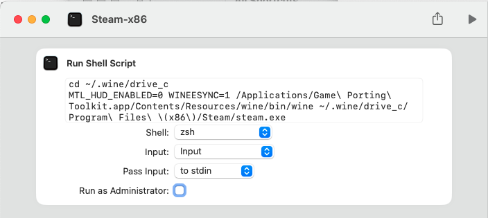

# Howto install the Windows version of Steam on macOS Sonoma

We will install the x86 version Homebrew in order to be able to use Apple's modified version of `Wine` and to install the Windows version Steam.

We will make sure that our existing environment (and the Apple silicon version of Homebrew we need for 'serious' work) remains undisturbed.


This guide is only tested for Apple Silicon machines.

## Latest tested versions

- 2024-06-11:  New version 2.0 beta available, and while the built process has _not_ been fixed, it's possible to install Steam relying on old prebuilt toolkits that we will manually update. 
- 2024-06-03:  Unfortunately Apple's installation is currently broken when not using a 3rd-party pre-built toolkit.
- 2024-03-24:  Apple's `game-porting-toolkit` currently requires an older version of Apple's command line tool (version 15.1) in order to install successfully! Current Xcode 15.3 __will not work__!

## Preparations:

- Go to [Apple Games](https://developer.apple.com/games/) in order to download the [Game Porting Toolkit](https://developer.apple.com/download/all/?q=game%20porting%20toolkit). There are two possible downloads: "Evaluation environment for Windows games 2.0 beta" and "Game porting toolkit 2.0 beta". The later is larger and contains the 'Evaluation environment' too. We will need the "Evaluation environment for Windows games 2.0" only.

The "Evaluation environment for Windows games 2.0" contains a Readme that outlines the installation process, but here we will customize it, in order to run Steam.

- [Download Steam](https://store.steampowered.com/about/download). Make sure to download the [Windows setup](https://cdn.akamai.steamstatic.com/client/installer/SteamSetup.exe), and not the (default) Mac version. You should now have a file `SteamSetup.exe`.

## Step-by-step installation

- The minimum macOS version is macOS Sonoma 14.5, a prebuilt game-porting-toolkit and Game Porting Toolkit 2
- This guide only applies to Apple Silicon Macs. No Intel support.
- Open a terminal (or iTerm2)
- Make sure that rosetta is installed by entering:

```bash
softwareupdate --install-rosetta
```

Now your Mac is able to execute x86_64 code. This is the basis for all the following installation.

- Now switch to a x86 shell by entering:

```bash
arch -x86_64 zsh 
```

Type `arch` again, to make sure that you are using Intel. It should **not** show `arm64`, but `i386` ( ;-) )

Now, from a terminal that uses `x86_64` arch, install homebrew for x86:

```bash
/bin/bash -c "$(curl -fsSL https://raw.githubusercontent.com/Homebrew/install/HEAD/install.sh)"
```

This will install the Intel x86 version of homebrew to `/usr/local`. If you already installed homebrew
for Apple Silicon, then that version resides in `/opt/homebrew` and won't be touched. This guide will assume that the Apple Silicon
homebrew is your important version, and will remain the default when working with terminal or using `brew`. If you do not have
an Apple Silicon version of homebrew installed, don't worry, nothing we do here requires that or modifies any of it.

Do **not** follow the recommendation at the end of the x86-homebrew install script to put `shellenv` into `.zprofile`. (That 
would put the x86 Version of Homebrew into your paths, conflicting with an Apple Silicon version of homebrew. No paths or
environment modifications are needed in order to proceed!)

In order not to mess up the two homebrew versions, we create an alias for the Intel homebrew:

```bash
alias brew86=/usr/local/bin/brew
```

Note: if you are following Apple's readme, make sure to replace all instances of `brew` in Apple's doc with `brew86` from now on.

## Installation using a pre-built toolkit

Use [Dean Greer's (GCenX)](https://github.com/Gcenx/game-porting-toolkit) versions of the toolkit that have been prebuilt. This is the faster installation method (and currently the only non-broken one):

```bash
brew86 install --cask --no-quarantine gcenx/wine/game-porting-toolkit
```

This installs a macOS Application "Game Porting Toolkit" based on the old working binaries that opens a pre-configured terminal with all the game-porting tools. Go to macOS 'Applications' and open "Game Porting Toolkit". In the terminal window that gets started by the application, enter:

`wine winecfg`

to verify everything is working. Close Winecfg and start with the update procedure to the latest drivers.

Make sure that you have opened the "Evalutaion environment for Windows Games". You should see a folder at `/Volumes/Evaluation environment for Windows games 2.0`. Then start the update:

```bash
cd /Applications/Game\ Porting\ Toolkit.app/Contents/Resources/wine/lib/external
mv D3DMetal.framework D3DMetal.framework-old; mv libd3dshared.dylib libd3dshared.dylib-old
ditto /Volumes/Evaluation\ environment\ for\ Windows\ games\ 2.0/redist/lib/external/ .

This is silent on success.

Now you are ready to install Steam (use a Terminal that is opened by the "Game Porting Toolkit" application!

```bash
MTL_HUD_ENABLED=0 WINEESYNC=1 wine ~/Downloads/SteamSetup.exe
```

After some time, the Steam login appears!

Steam has been installed into the wine prefix at `~/.wine` and your Toolkit software resides within the application "Game Porting Toolkit". From any Terminal, you can now start Steam directly with:

```bash
MTL_HUD_ENABLED=0 WINEESYNC=1 /Applications/Game\ Porting\ Toolkit.app/Contents/Resources/wine/bin/wine ~/.wine/drive_c/Program\ Files\ \(x86\)/Steam/steam.exe
```

This takes some times, but then Steam starts.

## Create a shortcut for Steam

We can use Apple's 'Shortcuts' app to automate the process of launching Wine & Steam Windows. Start the Shortcuts app, create a new shortcut and add the action 'Run Shell Script'.



The script text is:

```bash
cd ~/.wine/drive_c
MTL_HUD_ENABLED=0 WINEESYNC=1 /Applications/Game\ Porting\ Toolkit.app/Contents/Resources/wine/bin/wine ~/.wine/drive_c/Program\ Files\ \(x86\)/Steam/steam.exe
```

> **Note:** 'Shortcut' might ask you for confirmation, if you want to run scripts, and you need to enable that via the settings-link provided.

Add an icon to the shortcut, and you are ready to go. The shortcut can be put into the dock, and now you simply can directly start Steam for Windows! 
(Right-click the shortcut script in the 'Shortcuts' app and select 'Add to dock' to create shortcut for your shortcut in the Shortcuts app...)


### References

- Good collection of information: [Apple Gaming Wiki](https://www.applegamingwiki.com/wiki/Game_Porting_Toolkit)
- A 'batteries-included' GUI version to get the game-porting-toolkit running: [Whisky](https://github.com/Whisky-App/Whisky)
- Pre-built versions of the toolkit are available at [Gcenx repository](https://github.com/Gcenx/game-porting-toolkit/releases)

### History

- 2024-06-11: Apple releases `game_porting_toolkit` 2.0 beta 1, self-built is __still__ broken, but a work-around is available using a pre-built toolkit.
- 2024-03-26: Apple's `game_porting_toolit` requires Command Line Tools version 15.1 to build successfully, newer versions are not (yet) supported.
- 2024-03-24: Apple's `game_porting_toolkit` is broken, the project currently doesn't install until the build is fixed by Apple.
- 2024-03-08: macOS 14.4 testet ok.
- 2023-11-24: Apple Game Porting Toolkit 1.1 changes. Addressed suggestions by @mobigroup and @cdtj concerning username placeholders.
- 2023-10-06: New installations with Xcode 15, Sonoma 14.0 release and `game-porting-toolkit` 1.0 retested, ok.
- 2023-10-06: Small fixes for release version of `game-porting-toolkit` 1.0, Uninstallation and troubleshooting notes.
- 2023-09-26: macOS Sonoma 14.0 Release tested ok. No changes.
- 2023-09-24: Retest with Sonoma RC, `game-porting-toolkit` Beta 4 (Note: library path on Apple's IMG has changed from `lib` to `redist/lib`.
- 2023-08-14: Updates for `game-porting-tookit` Beta 3 alias 1.0.3 and Sonoma Beta 5. (No significant changes to the update procedure).
- 2023-07-04: Section **Update notes** added. Apple has published a new version 1.0.2 of the game-porting toolkit.
